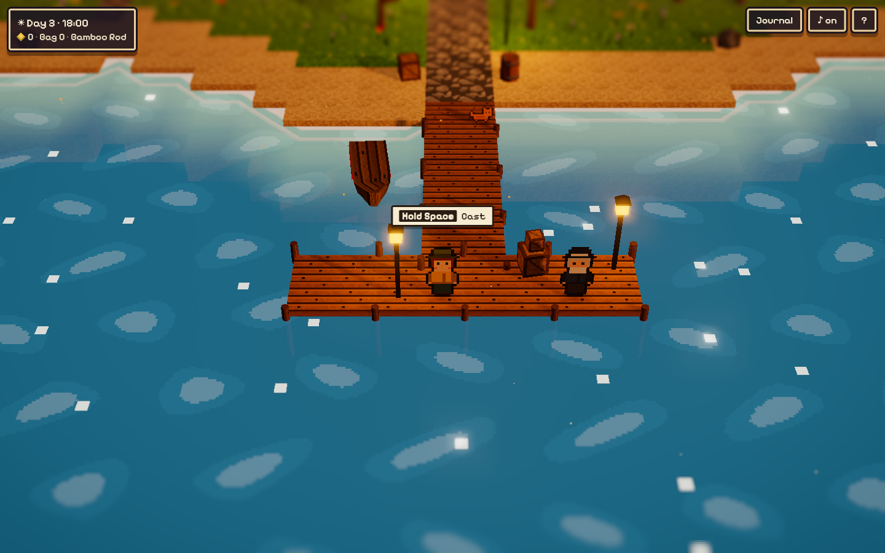

# Driftmoor Cove 🎣

A small, cozy **HD-2D fishing game** that runs in the browser. It has pixel-art characters in a lit 3D diorama with tilt-shift blur, bloom, real-time shadows and a full day/night cycle.

**▶ Play: https://ridermw.github.io/fishing/**

Every texture, sprite, fish and sound is generated in code at runtime. The game ships no image or audio files.



## Built in one Copilot session

This project began with a short gameplay video shared in an X post. In one Microsoft Scout/Copilot coding session, the assistant:

1. Downloaded the reference video for private analysis.
2. Studied its HD-2D visual language: pixel-art characters, a lit 3D diorama, tilt-shift blur and bloom.
3. Designed and implemented **Driftmoor Cove** as an original browser game with its own world, characters and progression.
4. Created the public [`ridermw/fishing`](https://github.com/ridermw/fishing) repository and deployed it to GitHub Pages.
5. Tested the complete loop in a real browser: cast, hook, reel, land a fish, sell it and inspect the journal.

The implementation was produced from scratch without imported art or audio. See [`docs/session.md`](docs/session.md) for the user-visible prompts and an engineering log of the session.

## How to play

| Action | Keys |
|---|---|
| Walk / run | WASD or arrows / hold Shift |
| Cast | Face the water, **hold Space** to wind up, release to cast |
| Hook | Press Space as soon as the **!** appears |
| Reel | **Hold Space** while the fish is calm and let go when it **runs** so the line doesn't snap |
| Journal / sound / help | J / M / H |

Touch screens get a virtual stick and an **A** button.

- **14 species.** What bites depends on sea or pond, shallow or deep water, and the time of day (day, night, dawn/dusk).
- **Sell** your catch to Marla at the market, then **buy better rods** that handle more tension, reel faster and attract rarer fish.
- Old Tobin at the end of the pier gives tips. Progress saves automatically in your browser.

## Tech

- [three.js](https://threejs.org) r169 (loaded from a CDN with an import map, so there is no build step)
- Procedural pixel textures and sprite sheets drawn on `<canvas>`, using instanced meshes for terrain and foliage
- Custom water shader with a shoreline distance field for foam and depth tint, plus an animated waterfall
- Post-processing: Unreal bloom, a custom tilt-shift pass, color grade and vignette
- WebAudio synthesized ambience and sound effects

## Run locally

```sh
python3 -m http.server 8000   # then open http://localhost:8000
```
